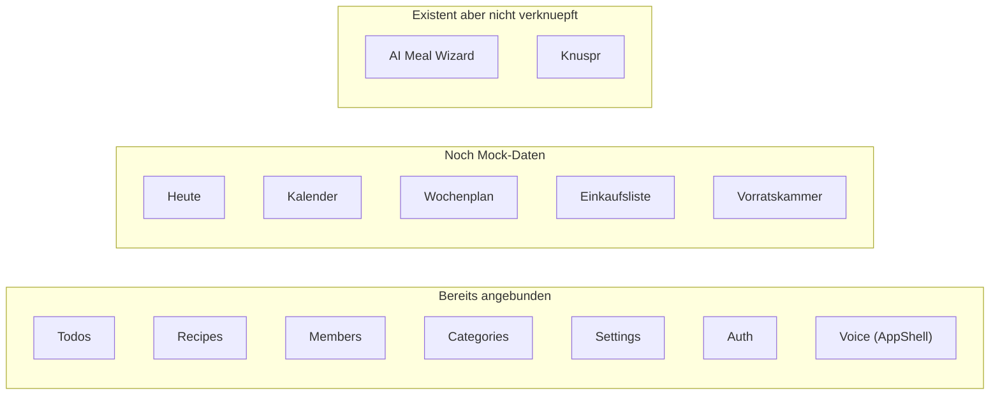

# Flutter-Frontend komplett an Backend anbinden

## Ist-Zustand

Die Repositories und Domain-Models fuer **alle** Module existieren bereits. Die 5 Mock-Screens muessen nur von hardcodierten Daten auf Riverpod-Provider + Repository-Calls umgestellt werden.

---

## Phase 1: Wochenplan (Essen-Tab)

**Dateien:** [flutter/lib/features/meals/presentation/week_plan_screen.dart](flutter/lib/features/meals/presentation/week_plan_screen.dart), [flutter/lib/features/meals/data/meal_repository.dart](flutter/lib/features/meals/data/meal_repository.dart), [flutter/lib/features/meals/domain/meal_plan.dart](flutter/lib/features/meals/domain/meal_plan.dart)

**Backend:** `GET /api/meals/plan?week=YYYY-MM-DD` liefert `WeekPlanResponse` mit `days: {date: {lunch, dinner}}`.

**Aufgaben:**
- `weekPlanProvider` als `FutureProvider` anlegen (wird auch von `ai_meal_plan_wizard.dart` via `ref.invalidate` erwartet, aktuell Compile-Error)
- `WeekPlanScreen` von `StatelessWidget` auf `ConsumerWidget` umstellen
- Hardcodierte `_sampleDays` / `_sampleSuggestions` entfernen, stattdessen `MealPlan` aus Provider
- `_MealCard` klickbar machen (z.B. Bottomsheet: Rezept ansehen, als gekocht markieren via `PATCH /api/meals/plan/{date}/{slot}/done`, Mahlzeit entfernen via `DELETE`)
- "Gericht hinzufuegen" (`_EmptyMealSlot`) -> Rezept-Picker (Liste aus `recipesProvider`) -> `PUT /api/meals/plan/{date}/{slot}`
- "KI Vorschlag"-Chip -> `AiMealPlanWizard` als BottomSheet oeffnen (existiert bereits in [flutter/lib/features/ai/presentation/ai_meal_plan_wizard.dart](flutter/lib/features/ai/presentation/ai_meal_plan_wizard.dart))
- Vorschlaege-Sektion: `recipeSuggestionsProvider` (existiert in recipe_list_screen) nutzen statt `_sampleSuggestions`
- Pull-to-Refresh + Loading/Error States

---

## Phase 2: Einkaufsliste (Einkauf-Tab)

**Dateien:** [flutter/lib/features/shopping/presentation/shopping_list_screen.dart](flutter/lib/features/shopping/presentation/shopping_list_screen.dart), [flutter/lib/features/shopping/data/shopping_repository.dart](flutter/lib/features/shopping/data/shopping_repository.dart), [flutter/lib/features/shopping/domain/shopping.dart](flutter/lib/features/shopping/domain/shopping.dart)

**Backend:** `GET /api/shopping/list`, `POST /api/shopping/generate`, `POST /api/shopping/items`, `PATCH /api/shopping/items/{id}/check`, `DELETE /api/shopping/items/{id}`, `POST /api/shopping/sort`, `POST /api/shopping/clear-all`

**Aufgaben:**
- `shoppingListProvider` als `FutureProvider` anlegen
- Screen von `StatefulWidget` mit lokaler `_categories`-Liste auf `ConsumerStatefulWidget` mit Provider umstellen
- "Einkaufsliste generieren" Button -> `POST /api/shopping/generate` mit aktuellem `week_start`
- Artikel manuell hinzufuegen -> `POST /api/shopping/items`
- Abhaken -> `PATCH /api/shopping/items/{id}/check`
- Loeschen -> `DELETE /api/shopping/items/{id}`
- "KI sortieren" Button -> `POST /api/shopping/sort`
- "Alle loeschen" -> `POST /api/shopping/clear-all`
- Pantry-Alerts aus `pantryRepositoryProvider.getAlerts()` statt Mock
- Pull-to-Refresh + Loading/Error States

---

## Phase 3: Vorratskammer (Pantry-Tab im Essen-Reiter)

**Dateien:** [flutter/lib/features/pantry/presentation/pantry_screen.dart](flutter/lib/features/pantry/presentation/pantry_screen.dart), [flutter/lib/features/pantry/data/pantry_repository.dart](flutter/lib/features/pantry/data/pantry_repository.dart), [flutter/lib/features/pantry/domain/pantry_item.dart](flutter/lib/features/pantry/domain/pantry_item.dart)

**Backend:** `GET /api/pantry` (+ `?category=`, `?search=`), `POST /api/pantry`, `PATCH /api/pantry/{id}`, `DELETE /api/pantry/{id}`, `GET /api/pantry/alerts`, `POST /api/pantry/alerts/{id}/add-to-shopping`, `POST /api/pantry/alerts/{id}/dismiss`

**Aufgaben:**
- `pantryItemsProvider` und `pantryAlertsProvider` als `FutureProvider` anlegen
- Screen von `StatelessWidget` auf `ConsumerWidget` umstellen
- Mock-Daten (`_sampleAlerts`, `_sampleCategories`) entfernen
- "Artikel hinzufuegen" -> Formular-Dialog -> `POST /api/pantry`
- Alert-Aktionen: "Zur Einkaufsliste" -> `POST /api/pantry/alerts/{id}/add-to-shopping`, "Ignorieren" -> `POST /api/pantry/alerts/{id}/dismiss`
- Artikel bearbeiten -> `PATCH /api/pantry/{id}`, loeschen -> `DELETE`
- Suche/Filter ueber `category` und `search` Query-Params
- Pull-to-Refresh + Loading/Error States

---

## Phase 4: Kalender

**Dateien:** [flutter/lib/features/calendar/presentation/calendar_screen.dart](flutter/lib/features/calendar/presentation/calendar_screen.dart), [flutter/lib/features/calendar/data/event_repository.dart](flutter/lib/features/calendar/data/event_repository.dart), [flutter/lib/features/calendar/domain/event.dart](flutter/lib/features/calendar/domain/event.dart), [flutter/lib/features/calendar/presentation/event_form_dialog.dart](flutter/lib/features/calendar/presentation/event_form_dialog.dart)

**Backend:** `GET /api/events?date_from=&date_to=` (+ `member_id`, `category_id`), `POST /api/events`, `PUT /api/events/{id}`, `DELETE /api/events/{id}`

**Aufgaben:**
- `calendarEventsProvider` als `FutureProvider.family` mit Monatsbereich anlegen
- Screen von `StatefulWidget` auf `ConsumerStatefulWidget` umstellen
- `_SampleEvent` und `_eventsForMonth()` entfernen, Events aus Provider laden (Bereich: sichtbares Monatsgitter)
- Events nach Tag gruppieren fuer Punkt-Anzeige im Grid + Tagesliste
- `Event.categoryColor` (Hex-String) zu `Color` parsen fuer farbige Balken
- FAB -> `EventFormDialog` oeffnen (existiert bereits, voll funktional mit CRUD)
- Event-Card antippen -> `EventFormDialog` im Edit-Modus
- Optional: `DayDetailPanel` (existiert) fuer Tablet/Landscape
- Bei Monatswechsel: neue Events laden (`ref.invalidate` oder `.family`-Parameter aendern)

---

## Phase 5: Heute-Screen (Dashboard)

**Dateien:** [flutter/lib/features/today/presentation/today_screen.dart](flutter/lib/features/today/presentation/today_screen.dart)

**Backend-Calls (zusammengesetzt aus mehreren Endpoints):**
- `GET /api/meals/plan?week=...` -> heutiges Abendessen fuer HeroCard
- `GET /api/events?date_from=heute&date_to=heute` -> heutige Termine
- `GET /api/todos?completed=false` -> offene Aufgaben (gefiltert auf due_today oder Top-N)
- `GET /api/family-members` -> Familienmitglieder-Bubbles

**Aufgaben:**
- `todayDinnerProvider`, `todayEventsProvider`, `todayTodosProvider` anlegen (oder ein kombinierter `todayDataProvider`)
- Screen auf `ConsumerWidget` umstellen
- Private Mock-Klassen (`_FamilyMember`, `_MemberStatus`, hardcodierte Event/Todo-Listen) entfernen
- HeroCard: heutiges Dinner aus MealPlan, "Rezept ansehen" navigiert zu Rezeptdetail
- Event-Liste: echte Events, Tap -> `EventFormDialog`
- Todo-Liste: echte Todos, Toggle -> `PATCH /api/todos/{id}/complete`
- Familien-Bubbles: `membersListProvider` nutzen (Status online/busy muss Mock bleiben, da Backend keine Praesenz kennt)
- "Alle sehen"-Links: `context.go('/calendar')` bzw. `context.go('/todos')`
- Pull-to-Refresh invalidiert alle Provider

---

## Phase 6: Verknuepfungen und Cleanup

- **AI Meal Plan Wizard** erreichbar machen: "KI Vorschlag"-Chip im Wochenplan oeffnet ihn als BottomSheet
- **`weekPlanProvider`** in eine eigene Provider-Datei, damit `ai_meal_plan_wizard.dart` den Import aufloest (aktuell Compile-Error wegen undefiniertem Provider)
- **Knuspr-Zugang:** Button in Einkaufsliste "Bei Knuspr bestellen" -> navigiert zu `KnusprScreen`; Route in `router.dart` hinzufuegen
- **Error Handling** konsistent: `ApiException` fangen, `showAppToast` fuer Fehler
- **Loading States** konsistent: Skeleton/Shimmer oder `CircularProgressIndicator` waehrend Provider laden
- **Empty States:** Leere Listen freundlich darstellen ("Keine Termine heute", "Einkaufsliste ist leer")

---

## Nicht im Scope (bewusst ausgeklammert)

- **Offline-Queue (enqueue):** Die `PendingChangeService` + `SyncService`-Infrastruktur existiert, aber Mutations aus den Screens in die Queue zu schreiben ist ein eigenes Projekt
- **Push-Notifications / Praesenz:** Backend hat kein Presence-System
- **Cookidoo/Knuspr Deepening:** Beide sind bereits funktional angebunden in eigenen Screens

