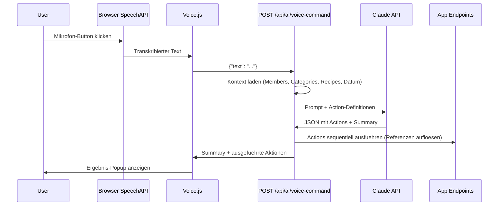

# Sprachbefehl-Feature fuer den Familienkalender

## Architektur-Ueberblick



## Kernentscheidungen

- **Speech-to-Text**: Browser Web Speech API (`SpeechRecognition`) -- kostenlos, keine Abhaengigkeit, Deutsch-Support (`lang: "de-DE"`)
- **Single-Call JSON statt Tool-Use-Loop**: Claude bekommt einen Prompt mit allen moeglichen Aktionstypen und liefert ein JSON-Objekt mit `actions[]` und `summary` zurueck. Vorteil: Ein einziger API-Call, keine Latenzkette
- **Referenz-System fuer Abhaengigkeiten**: Claude verwendet Platzhalter-Refs (z.B. `"ref": "evt1"`), damit Todos per `"event_ref": "evt1"` auf noch nicht erstellte Events verweisen koennen. Das Backend loest diese nach Erstellung auf
- **Kontext-Anreicherung**: Vor dem Claude-Call werden Members, Categories und Rezepte geladen, damit Claude Namen wie "Michi" auf `member_id` aufloesen kann

## Unterstuetzte Aktionen

Basierend auf den vorhandenen Endpoints:

- `create_event` -- Event anlegen (mit Member-Zuordnung, Kategorie)
- `create_todo` -- Todo anlegen (mit Event-Link, Sub-Todos, Prioritaet)
- `create_recipe` -- Rezept anlegen (mit Zutaten)
- `set_meal_slot` -- Wochenplan-Slot belegen
- `add_shopping_item` -- Einkaufsliste ergaenzen
- `complete_todo` -- Todo als erledigt markieren
- `mark_cooked` -- Mahlzeit als gekocht markieren

## Aenderungen

### 1. Neues Schema: [backend/app/schemas/ai.py](backend/app/schemas/ai.py)

Neue Pydantic-Models:
- `VoiceCommandRequest` -- `text: str`
- `VoiceCommandAction` -- `type: str`, `ref: str | None`, `params: dict`, `result: dict | None`
- `VoiceCommandResponse` -- `summary: str`, `actions: list[VoiceCommandAction]`

### 2. Neuer Endpoint: [backend/app/routers/ai.py](backend/app/routers/ai.py)

`POST /api/ai/voice-command` -- Neuer Endpoint (~200 Zeilen):

- `_build_voice_context()` -- Laedt Members, Categories, Rezepte, aktuelles Datum fuer den Prompt
- `_build_voice_prompt()` -- Erstellt System-Prompt mit allen Aktionstypen, ihren Parametern und dem Referenz-System. Enthaelt Beispiele wie das Meeting-Szenario des Users
- `_execute_voice_actions()` -- Fuehrt Actions sequentiell aus:
  1. Sortiert nach Abhaengigkeiten (Events vor Todos)
  2. Fuehrt jede Action per direktem DB-Zugriff aus (nicht ueber HTTP-Endpoints, sondern direkte SQLAlchemy-Operationen wie in den bestehenden Routern)
  3. Loest `event_ref` / `todo_ref` Platzhalter in echte IDs auf
  4. Sammelt Ergebnisse

### 3. Neues JS-Modul: `backend/app/static/js/voice.js` (neu)

IIFE-Modul `Voice` mit:
- `init()` -- Pruefen ob `webkitSpeechRecognition`/`SpeechRecognition` verfuegbar, Button-Listener
- `startListening()` -- SpeechRecognition starten (`lang: "de-DE"`, `continuous: false`)
- `stopListening()` -- Aufnahme stoppen
- `sendCommand(text)` -- `POST /api/ai/voice-command`
- `showResult(response)` -- Ergebnis-Popup (aehnlich wie `_showReasoningPopup` im AI-Feature) mit Summary und Liste der ausgefuehrten Aktionen
- UI-States: idle / listening (pulsierend) / processing (Spinner) / success / error

### 4. HTML: [backend/app/static/index.html](backend/app/static/index.html)

- Floating Mic-Button im `#app-screen` (nach dem letzten `<main>`, vor den Modal-Overlays):
  ```html
  <button id="voice-cmd-btn" class="voice-fab" title="Sprachbefehl">
    <span class="voice-fab-icon">&#127908;</span>
  </button>
  ```
- `<script src="/js/voice.js?v=17">` einbinden

### 5. CSS: [backend/app/static/css/style.css](backend/app/static/css/style.css)

- `.voice-fab` -- Position fixed, bottom-right, runder Button, z-index ueber Content aber unter Modals
- `.voice-fab.listening` -- Pulsierender roter Ring (CSS-Animation)
- `.voice-fab.processing` -- Spinner-Animation
- `.voice-result-overlay` / `.voice-result-box` -- Ergebnis-Popup (Stil konsistent mit `.ai-reasoning-overlay`)
- `.voice-action-item` -- Einzelne ausgefuehrte Aktion in der Ergebnisliste
- Responsive-Regeln fuer Mobile

### 6. App-Initialisierung: [backend/app/static/js/app.js](backend/app/static/js/app.js)

- In `showApp()`: `Voice.init()` aufrufen (neben den anderen Modul-Initialisierungen)

## Prompt-Strategie (Kern des Features)

Der Claude-Prompt enthaelt:
1. **Rolle**: "Du bist der Sprachassistent des Familienkalenders"
2. **Aktuelles Datum/Uhrzeit**: Damit "Montag" korrekt aufgeloest wird
3. **Verfuegbare Members** mit IDs und Namen
4. **Verfuegbare Kategorien** mit IDs und Namen
5. **Verfuegbare Rezepte** (Top 50 nach Titel) mit IDs
6. **Aktionstypen-Dokumentation** mit allen Feldern und Enums
7. **Referenz-System**: Erklaerung wie `ref` und `event_ref`/`todo_ref` funktionieren
8. **Antwort-Format**: Strikt JSON mit `actions[]` und `summary`
9. **Beispiel**: Das Meeting-Szenario aus der User-Anfrage

## Fallback bei fehlendem Speech-API

Falls der Browser keine SpeechRecognition unterstuetzt (z.B. Firefox): Button zeigt Texteingabe-Fallback (Input-Feld statt Mikrofon).
